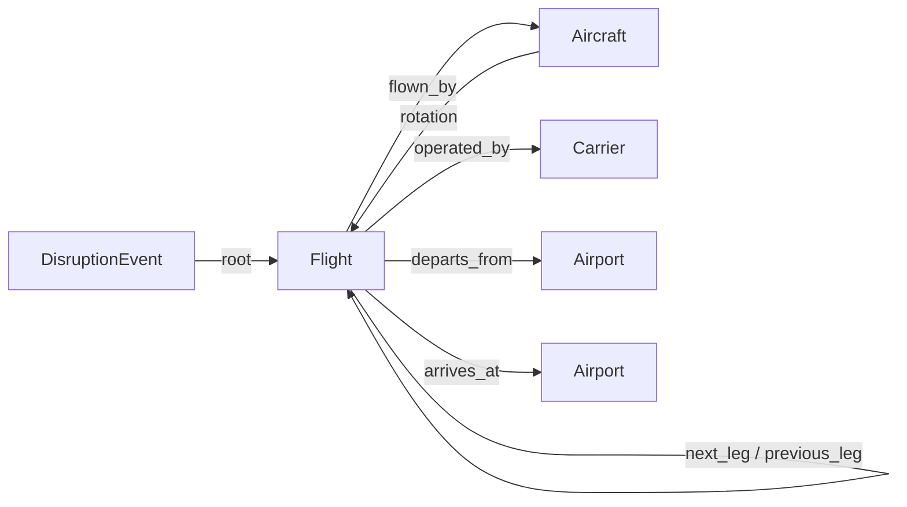

# flightops

**Which delay is actually costing today, where it lands next, and what a recovery buys.**

An ontology-backed operational tool over US Bureau of Transportation Statistics On-Time
Performance data. Five objects, typed links between them, three actions that return a diff
instead of mutating anything, and a question-answering layer that can only reach the data through
those same objects.

**[Live](https://flightops-woad.vercel.app)** ·
[API](https://flightops-api.onrender.com/api/health)

The API runs on a free tier that sleeps when idle, so a first visit after a quiet spell waits out
a cold start of up to a minute. The page says so while it retries, and says so plainly if the API
never answers. The repository, the container image and the recorded eval do not depend on it.


---

## The problem it is built around

A delay is not one flight being late. An aircraft flies six or seven legs a day, and a late
inbound pushes the next departure, which pushes the one after that. An operations controller
looking at a board of late flights is looking at the symptoms of a handful of disruptions. What
they cannot see at a glance is which of those disruptions is worth spending a spare aircraft on.

So the landing view does not rank flights by how late they are. It ranks roots by the minutes
they force onto everything downstream, one per aircraft, and it excludes legs whose delay BTS
itself attributes to a late inbound aircraft. Those are consequences, not causes.

One caveat belongs up front. The operations controller this is built for is a constructed persona
assembled from published sources, not from interviews. I did not talk to an operations controller
and I am not going to claim otherwise. What the persona rests on instead is documented below,
along with the specific thing that grounding does not establish.

---

## What the persona is grounded in, and what it is not

Three published sources carry most of the weight. Two of them corroborate the mechanics this
project implements.

**The propagation rule is not mine.** BTS's own technical directive for on-time reporting
specifies how a carrier must attribute delay to a late inbound aircraft: minutes assigned can
never exceed the previous flight's delay, and the carrier must account for scheduled ground time
and its allotted turn time. Their worked example is the absorption case exactly. A flight
arriving 60 minutes late at 02:15, with a 20-minute turn and a 04:00 scheduled departure, yields
no attributable late-aircraft minutes, because the schedule buffer swallows it. That is
`projected_dep = max(sched_dep, projected_arr + min_turn)`, written by the regulator before it
was written here. ([Understanding the Reporting of Causes of Flight Delays and
Cancellations](https://www.bts.gov/topics/airlines-and-airports/understanding-reporting-causes-flight-delays-and-cancellations),
[Technical Directive
#39](https://www.bts.gov/explore-topics-and-geography/modes/aviation/number-39-technical-directive-reporting-time))

**The root-versus-consequence split is an industry category, not an invention.** IATA's AHM 730
delay coding, the global standard since the 1980s, puts rotation delay at code **93 (RA),
"aircraft rotation: late arrival of aircraft from another flight"**, inside the reactionary 9x
block. Its code **09 (SG)** is "scheduled ground time less than declared minimum ground time",
which is the `min_turn` concept as a reporting category. Excluding legs whose delay is mostly
inherited, and treating minimum turn as the thing that decides absorption, is how the industry
already codes it. ([IATA AHM 730 standard delay
codes](https://ansperformance.eu/library/iata-delay-codes.pdf))

**The recovery levers are the studied ones.** The aircraft recovery problem has a literature
going back to Teodorović and Guberinić (1984), and its standard reactive levers are delay,
cancel, swap, and ferry. This tool implements the first three and names the fourth as out of
scope. ([Santana et al., *The aircraft recovery problem: a systematic literature
review*](https://www.sciencedirect.com/science/article/pii/S2192437623000146); [Hassan, Santos &
Vink, *Airline disruption management: a literature review and practical challenges*, Computers &
Operations Research 127
(2021)](https://www.sciencedirect.com/science/article/abs/pii/S0305054820300095))

**What none of that establishes.** The sources validate the mechanics. They do not validate the
premise. The claim in DESIGN.md §2 is that an operations controller lacks rotation-cascade
visibility, and the evidence points the other way. Aircraft recovery is a decades-old field with
mature commercial tooling, and BTS itself publishes an ["Aircraft Arriving Late: Causes of the
Original Delay"](https://www.transtats.bts.gov/AircraftDelay/mainpage.aspx) tool that traces
exactly this chain. A real IOC almost certainly has rotation projection already.

So the honest position is narrower than the original one. This project demonstrates a correct,
checkable implementation of a well-specified operational mechanic, plus a measurement that
contradicted its own starting assumption. It does not demonstrate that anyone needs it.
`docs/interview-guide.md` holds the questions that would settle that, written to falsify rather
than confirm. `DECISIONS.md` lists which decisions a real conversation could reverse. Both stay
in the repo as unfinished business rather than as completed work.

---

## What the data actually says, measured twice

The premise this project started from was that a delay amplifies down a rotation: forty minutes
at one station becoming three hours by evening. Measured over one BTS month, that turned out to
be mostly wrong, and the correction was more interesting than the premise. One month is a weak
place to leave a finding that contradicts your own brief, so the whole measurement was re-run,
unchanged, on a second month picked to be as operationally different as this data allows.
**July 2025**, against the original **January 2026**.

They are different months, and measurably so:

| | January 2026 | July 2025 |
|---|---|---|
| Flights | 544,003 | 628,920 |
| Reporting carriers | 13 | 14 (HA is absent from January) |
| Arrived 15+ minutes late | 20.8% | **28.9%** |
| Cancelled | **4.7%** | 2.4% |
| Share of delay minutes coded late-aircraft | 35% | **41%** |

January is the cancellation month; July is the delay month. Ingestion needed no change to run on
July beyond an output path, and nothing below was tuned to make the two agree.

### The cascade shape replicates

| Roots delayed 60+ min whose own delay is not mostly inherited | January 2026 | July 2025 |
|---|---|---|
| Propagate nothing at all, absorbed by scheduled ground time | 44% | 47% |
| Median delay carried into the *first* downstream leg | **0.91×** | **0.91×** |
| Median downstream legs affected | **1** | **1** |
| Median summed downstream minutes ÷ root delay | 1.00× | 0.95× |
| Mean summed downstream minutes ÷ root delay | 1.35× | 1.06× |
| Roots where summed downstream minutes exceed the root | 43% | 31% |

Per-leg delay **damps**, at the same 0.91× in both months, and the median cascade is one leg long
in both. Schedule padding does real work in a quiet January and a congested July alike.

Where the months diverge, they diverge against the premise rather than for it. The amplification
tail, meaning the minority of roots whose summed downstream minutes exceed the root, is largely a
January property: 43% against 31%, mean 1.35× against 1.06×. Summing across legs and calling it
amplification was always the weaker of the two readings, and the second month makes it weaker
still.

This changes the product, not just the README. If nearly half of large delays cost nothing
downstream, the valuable thing is not a cascade visualiser. It is the ranking that tells you
which delays are in the other half. On 2026-01-03 the four latest departures of the day (422,
367, 362 and 324 minutes) are all absent from that ranking: three because their own delay was
inherited from a late inbound, and the 422 because its rotation record cannot be followed past
that leg. The top row is a 142-minute delay that cost 565 downstream minutes across five legs,
two rows above a 343-minute delay that cost 338 across one.

### The month that cascades less has far more to triage

The table above measures the shape of a cascade. It says nothing about how many there are. Over
the whole qualifying population rather than the replayed sample:

| | January 2026 | July 2025 |
|---|---|---|
| Qualifying roots in the month | 20,878 | 34,829 |
| Per day | 673 | **1,124** |
| Per 1,000 flights flown | 40.4 | **57.1** |

July has 67% more roots to triage each day, and each one travels less far. A single January could
not have produced that, and it points the same way the first correction did. The ranking is more
valuable in the season where the cascade picture is less dramatic, and a tool designed around
long cascades would have been designed for the wrong month.

### Propagation, checked against the data's own answer

BTS records `LateAircraftDelay`: the carrier's own attribution of how much of a leg's delay came
from its inbound aircraft. It is produced independently of anything here, and it was measured to
partition arrival delay exactly, so it is a clean check on the quantity this engine predicts.

| | Sample (WN, one week) | January 2026 | July 2025 |
|---|---|---|---|
| Roots replayed | 359 | 400 | 400 |
| Downstream legs compared | 587 | 669 | 560 |
| Median error | +5 min | **+14 min** | **+7 min** |
| Within 30 min of BTS | 75% | 59% | 62% |
| BTS says late, engine says on time | **0** | **0** | **0** |

The row that had to hold holds in both: the engine never misses a cascade BTS saw. The bias is
positive in both, and it halves in July. That is where the replication paid for itself, because
it falsified one of the two explanations this README previously offered for the bias.

The two candidates were block-time optimism (projecting arrival as departure plus scheduled block
over-predicts, because actual block times beat scheduled ones) and intervention (the engine
projects a do-nothing world, while the recorded outcome is a world where a controller acted).
Median actual-minus-scheduled block time is **−8 minutes in January and −7 in July**, which is
effectively identical, so block-time optimism cannot account for a bias that halves between them.
The cancellation rate is 4.7% against 2.4%: roughly twice as much of the most decisive
intervention available, in the month where the engine over-predicts roughly twice as much. That
is consistent with the intervention explanation rather than proof of it, since cancellations were
not traced to the specific roots replayed. But it is the candidate left standing, and one month
could not have told the two apart.

Every number above comes from the same two commands, pointed at a different file:

```bash
python -m flightops.propagation.validate                       # the committed sample

python scripts/fetch_data.py --month 2026-01 --database data/flights_2026_01.duckdb
python -m flightops.propagation.validate data/flights_2026_01.duckdb

python scripts/fetch_data.py --month 2025-07 --database data/flights_2025_07.duckdb
python -m flightops.propagation.validate data/flights_2025_07.duckdb
```

The month-character and root-population figures come from `scripts/compare_months.py`, which
takes the two databases and prints the three tables above it.

---

## The ontology



Five objects. `next_leg` is the only derived link and the one everything rests on: the same
tail's immediately following leg, present only where that leg departs the station this one
arrived at, ordered in UTC because a rotation crossing timezones cannot be ordered any other way.

**Where the link is absent, the reason is recorded rather than guessed.** It is one of
`station_discontinuity` (a ferry or positioning move that OTP data does not contain),
`impossible_turn` (the same tail scheduled to leave a station before it lands there, which is a
tail-assignment artefact in the source), or `end_of_window`. 93% of legs link in the full month.
The other 7% are counted by reason and never bridged.

Three actions, `delay_flight`, `swap_aircraft` and `cancel_flight`, each returning a structured
diff. Impossibilities reject with the specific precondition that failed. Costly-but-real
consequences are flagged as warnings and applied anyway, because carriers strand rotations on bad
days deliberately, and a tool that refuses is a tool that gets worked around.

Nothing writes. A scenario is a pinned clock plus an overlay over the immutable base data, which
is what lets the deployed API ship its DuckDB file read-only and still give every visitor their
own sandbox.


---

## Question answering, and how it is checked

The model gets exactly three tools mirroring the ontology (`find_objects`, `traverse_links`,
`simulate_action`) and no SQL path, because it is never handed the store. Answers must cite
object ids so every number can be re-checked against the data.

Against it runs a **SQL baseline**: same model, same shared prompt preamble, same 40-row cap, one
read-only `SELECT` tool, and the derived rotation tables plus the projection formula written out
in full. Hiding those would have been beating a strawman.

Ten questions, every expected answer computed by hand against the committed sample and recorded
in [docs/EVAL.md](docs/EVAL.md). Grading is programmatic rather than an LLM judge: cited ids,
numeric values, required phrasings, forbidden claims. Two of the ten are there because the object
layer can lose them. One needs a count of 106 objects through a tool that returns 40, which SQL
does in a single `GROUP BY`. One has no answer in the data at all and is graded on refusing
rather than inventing a 737.

### The result

| | Ontology agent | SQL baseline |
|---|---|---|
| Score | **9 / 10** | **8 / 10** |
| Cost per answer | $0.262 | **$0.159** |
| Total for ten questions | $2.62 | $1.59 |
| Tool calls | 84 | 54 |

Run on `claude-opus-5`, both agents, one live run, no retries and no cherry-picking. Every
transcript is in `data/transcripts/`, and `python scripts/run_eval.py --replay` re-grades them
offline without an API key.

**The ontology agent wins by one question, and it is not the interesting part.** What matters is
that the two agents fail in completely different places, and both failure modes were written down
before the run.

**Its one loss is the predicted one.** `cancellations-by-reason` needs a count of 106 objects
through a tool that returns at most 40. The agent spent **38 tool calls and $1.14** trying to page
that count and still could not produce it. SQL answered it in 4 calls for **$0.04**, thirty times
cheaper. The eval was built to expose that ceiling and it did.

**Both of the baseline's losses are citation failures, not wrong answers.** On
`cascade-projection` it computed the whole cascade correctly and referred to the root as
"WN3851", never writing the object id. On `rotation-traversal` it laid out all seven legs
correctly and never once named the tail, `N8633A`, which was the object the question asked about.
The ontology agent cited both, because its tools hand it ids and SQL hands it rows. That is the
argument this project makes, and it is the one thing here that came out as designed.

**The cost gap is one question, not a property of the layer.** The baseline looks 39% cheaper per
answer, and that reads as a real tax on the object layer until you remove the row-cap question
from both sides. Do that and the ontology agent costs $0.165 per answer against the baseline's
$0.173. The premium is not the ontology being expensive. It is one question where the object
layer thrashes against its own cap, and the honest conclusion is that a `count` tool would have
fixed it.

The question stays in the set regardless. Removing it after seeing it fail would be the whole
problem with self-graded evals.

**One thing the replay harness found that the scores do not show.** Every transcript's tool calls
are re-executed against a freshly built store on every `make check`, so a change to propagation or
the store that would alter a published answer breaks the build. All ten ontology transcripts
replay byte for byte. Two of the baseline's do not, and the reason is in the SQL the model wrote:

```sql
SELECT origin, count(*) n, string_agg(DISTINCT cancellation_code, ',') codes
FROM flights WHERE status = 'cancelled' GROUP BY 1 ORDER BY n DESC LIMIT 8
```

Many origins tie at `n = 5`, so `ORDER BY n DESC LIMIT 8` does not define which eight rows come
back, and `string_agg` without an inner `ORDER BY` does not define the order inside the string.
Re-running it returns a different answer. That is not a bug in this repository, so the test
re-runs any disagreeing query and only fails when a query is stable on re-run and still disagrees
with its recording. It is worth stating plainly though: two of the twenty published answers rest
on a query that does not give the same result twice, and both are on the SQL side.

---

## Architecture

```
  Vercel (static export)                  Render (container)
  ┌───────────────────────┐   fetch       ┌──────────────────────────────────┐
  │ Next.js, no server    │ ────────────► │ FastAPI                          │
  │ ranked list           │               │  ├── ObjectStore (read-only)     │
  │ cascade + recovery    │               │  ├── PropagationEngine           │
  │ question / eval panel │               │  ├── Actions (diffs, never mutate)│
  └───────────────────────┘               │  ├── scenario sessions (memory)  │
                                          │  └── agent: 3 tools, env-gated   │
                                          │      DuckDB baked into the image │
                                          └──────────────────────────────────┘
```

```
src/flightops/
  ingest/       BTS load, timezone resolution, rotation derivation, data-quality checks
  model/        pydantic objects, typed links, the read-only store, the scenario overlay
  propagation/  the cascade engine, validation against BTS, and the daily root ranking
  actions/      delay / swap / cancel, preconditions and diffs
  agent/        three tools, the loop, record-replay, the eval set, the SQL baseline
  api/          FastAPI over all of it, plus per-session sandboxes
```

Deployment, and what is deliberately *not* deployed: [docs/DEPLOY.md](docs/DEPLOY.md).

---

## Limitations, named

These are in the product because they are real, not because they were overlooked.

- **No crew.** BTS has none. Crew legality is the first thing a real controller will raise about
  any recovery suggestion here, and a swap this tool proposes may be illegal for reasons it
  cannot see.
- **No aircraft type.** BTS carries the tail number but not the type, so `swap_aircraft` checks
  carrier, position and timing. It never checks whether the replacement can actually fly the
  route or seat the passengers. Every swap diff says so.
- **No passengers.** Nothing here knows about misconnects or rebooking, which is a large part of
  what makes one cancellation worse than another.
- **A swap does not re-project the donor.** The displaced aircraft takes over the replacement's
  remaining line of flying, and the diff says the number it reports is relief on this rotation,
  not net effect on the network.
- **Ferry and positioning moves are invisible**, which is why 7% of legs have no `next_leg`.
- **Two months, not a year.** January 2026 and July 2025 bracket the seasonal range usefully, and
  the cascade shape held across both. They are still two points: no shoulder season, no
  year-over-year comparison, and no single named disruption event traced end to end.

---

## Running it

```bash
make install     # venv, package with dev+agent extras, npm install
make api         # :8000, builds data/sample/sample.duckdb from the committed CSV on first run
make web         # :3000, the frontend, pointed at the local API
make check       # ruff, mypy --strict, pytest, and the frontend typecheck
make docker      # the API image, exactly as the deploy builds it
```

135 tests, all offline and deterministic, against the committed one-week sample. That includes
re-grading every committed eval transcript, so a change to propagation or the store that would
have altered a published answer fails the build. The full months are gitignored and rebuilt on
demand:

```bash
python scripts/fetch_data.py --month 2026-01 --database data/flights_2026_01.duckdb
python scripts/fetch_data.py --month 2025-07 --database data/flights_2025_07.duckdb
```

---

## Where the judgement is written down

[`DECISIONS.md`](DECISIONS.md) holds every non-obvious choice with what was rejected and why,
dated by milestone. It includes the ones that went wrong: a double-counting bug in the recovery
actions that 61 passing tests did not catch and that overstated the value of the tool's own
advice by nearly 3×, a chain-break reason the design did not anticipate, and a data-quality
expectation the data falsified in a way that made the propagation check possible at all.

[`DESIGN.md`](DESIGN.md) holds the object model, the propagation definition, the scope guard, and
the pushback recorded against the original brief before any code was written.

[`TRAINING.md`](TRAINING.md) is one page for the person who runs the day: three tasks in ten
minutes, in their vocabulary, with every failure mode named.

[`docs/EVAL.md`](docs/EVAL.md) holds the ten questions, the hand-verified answers, and what each
one is testing. [`docs/DEPLOY.md`](docs/DEPLOY.md) covers how it ships, and what deliberately
does not.

## Status

Ingestion, the object model, propagation, actions, the question-answering layer, the API and the
frontend are built, tested and deployed. The eval has been run: 9/10 for the ontology agent and
8/10 for the SQL baseline, transcripts committed. One thing is outstanding and it is not hidden.

- **Discovery.** No interviews were held. The persona is built from published sources: BTS
  reporting directives, IATA AHM 730 delay coding, and the aircraft-recovery literature. Those
  corroborate the mechanics but not the premise that anyone lacks this capability.
  `docs/interview-guide.md` holds the questions that would settle it, and `DECISIONS.md` names
  the decisions they could reverse.

## Data

US DOT / Bureau of Transportation Statistics, On-Time Reporting Carrier On-Time Performance,
January 2026 and July 2025, from <https://transtats.bts.gov>. Public domain. The deployed API
serves January 2026; July 2025 is the replication month and is measured offline. Airport
timezones and carrier names are two small committed reference tables with provenance noted
in-file.
