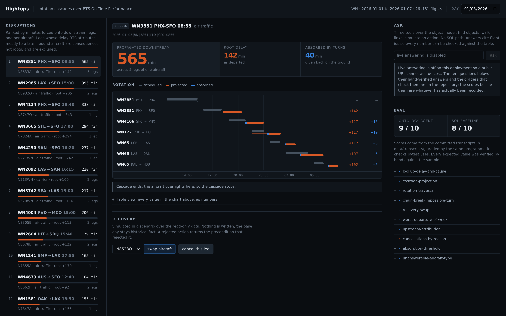
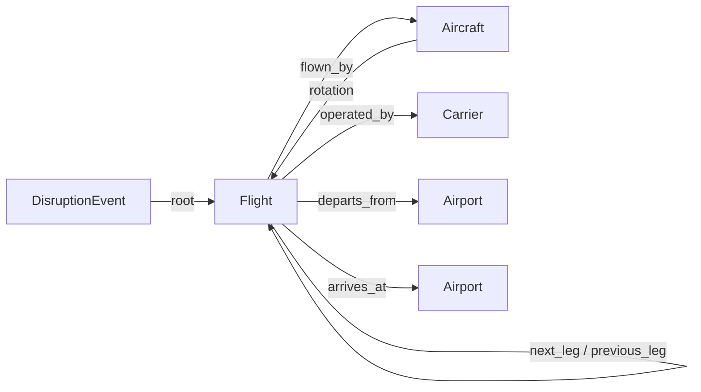
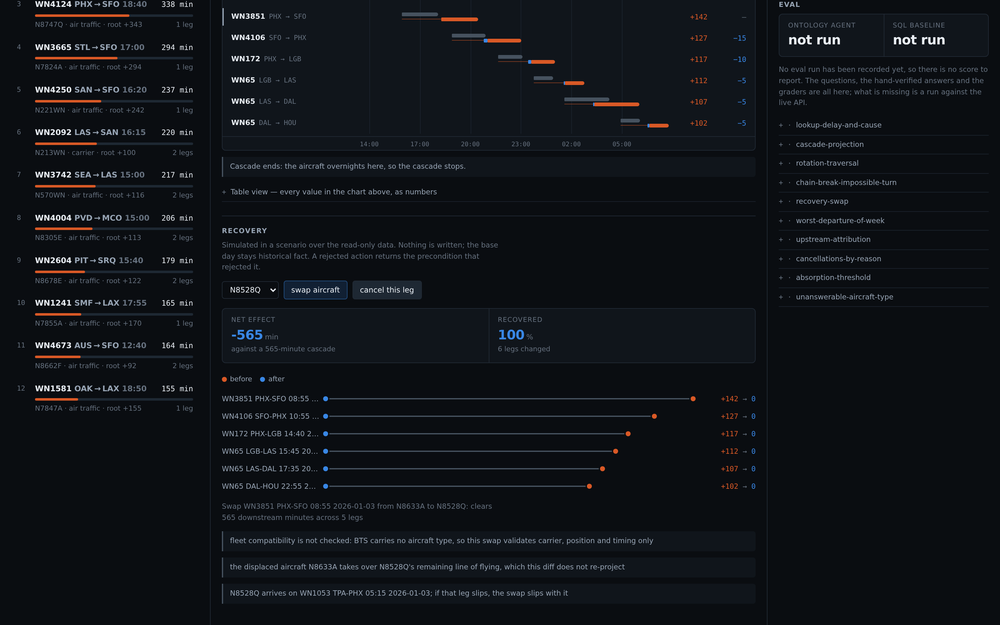

# flightops

**Which delay is actually costing today, where it lands next, and what a recovery buys.**

An ontology-backed operational tool over US Bureau of Transportation Statistics On-Time
Performance data. Five objects, typed links between them, three actions that return a diff
instead of mutating anything, and a question-answering layer that can only reach the data through
those same objects.



---

## The problem it is built around

A delay is not one flight being late. An aircraft flies six or seven legs a day, and a late
inbound pushes the next departure, which pushes the one after that. An operations controller
looking at a board of late flights is looking at the *symptoms* of a handful of disruptions, and
the thing they cannot see at a glance is which of those disruptions is worth spending a spare
aircraft on.

So the landing view does not rank flights by how late they are. It ranks *roots* by the minutes
they force onto everything downstream, one per aircraft, and it excludes legs whose delay BTS
itself attributes to a late inbound aircraft — those are consequences, not causes.

**One honest caveat, stated first.** The operations controller this is built for is a
*constructed persona*, not a customer. Three real conversations are scheduled (the questions are
in [docs/interview-guide.md](docs/interview-guide.md), written to falsify the assumptions above
rather than confirm them). Until those happen, the claim that rotation-cascade visibility is the
gap is a hypothesis I chose, and `DECISIONS.md` lists which decisions discovery could reverse.

---

## What the data actually says

The premise this project started from was that a delay *amplifies* down a rotation — forty
minutes at one station becoming three hours by evening. Measuring it first, over one BTS month
(544,003 flights, 13 carriers), that turns out to be mostly wrong, and the correction is more
interesting than the premise:

| Measured over 894 roots delayed 60+ minutes | |
|---|---|
| Propagate nothing at all — absorbed by scheduled ground time | **44%** |
| Median delay carried into the *first* downstream leg | **0.91×** the root |
| Median downstream legs affected | **1** |
| Roots where summed downstream minutes exceed the root delay | **43%** |

Per-leg delay **damps**; schedule padding is doing real work. What can still exceed the root is
the *sum* across legs, and only for the minority of roots that reach several. Those are two
different claims and the motivating example conflates them.

This changes the product, not just the README. If nearly half of large delays cost nothing
downstream, the valuable thing is not a cascade visualiser — it is the ranking that tells you
which delays are in the other half. On 2026-01-03 the four latest departures of the day (422,
367, 362 and 324 minutes) are all absent from that ranking — three because their own delay was
inherited from a late inbound, and the 422 because its rotation record cannot be followed past
that leg — while the top row is a 142-minute delay that cost 565 downstream minutes and eleventh is a
54-minute delay that cost 201.

**Propagation, checked against the data's own answer.** BTS records `LateAircraftDelay`: the
carrier's own attribution of how much of a leg's delay came from its inbound aircraft. It is
produced independently of anything here, and it was measured to partition arrival delay exactly,
so it is a clean check on the quantity this engine predicts.

| | Sample (WN, one week) | Full month (13 carriers) |
|---|---|---|
| Roots replayed | 359 | 400 |
| Downstream legs compared | 587 | 669 |
| Median error | **+5 min** | **+14 min** |
| Within 30 min of BTS | 75% | 59% |
| BTS says late, engine says on time | **0** | **0** |

The bias is positive in both, and the reasons are known rather than mysterious: actual block
times routinely beat scheduled ones, so projecting arrival as departure plus *scheduled* block
over-predicts. And the engine projects a do-nothing world while the recorded outcome is a world
where a controller intervened — a cascade the model predicts and BTS does not record is
sometimes a cascade someone prevented, which is the tool's entire point. The zero in the last row
is the reassuring one: the engine never misses a cascade BTS saw.

Both tables above are produced by one command:

```bash
python -m flightops.propagation.validate                      # the committed sample
python -m flightops.propagation.validate data/flights.duckdb  # the full month, after fetch_data.py
```

---

## The ontology



Five objects. `next_leg` is the only derived link and the one everything rests on: the same
tail's immediately following leg, present only where that leg departs the station this one
arrived at, ordered in UTC because a rotation crossing timezones cannot be ordered any other way.

**Where the link is absent, the reason is recorded rather than guessed** —
`station_discontinuity` (a ferry or positioning move that OTP data does not contain),
`impossible_turn` (the same tail scheduled to leave a station before it lands there — a
tail-assignment artefact in the source), or `end_of_window`. 93% of legs link in the full month;
the other 7% are counted by reason and never bridged.

Three actions — `delay_flight`, `swap_aircraft`, `cancel_flight` — each returning a structured
diff. Impossibilities reject with the specific precondition that failed; costly-but-real
consequences are flagged as warnings and applied anyway, because carriers strand rotations on bad
days deliberately and a tool that refuses is a tool that gets worked around.

Nothing writes. A scenario is a pinned clock plus an overlay over the immutable base data, which
is what lets the deployed API ship its DuckDB file read-only and still give every visitor their
own sandbox.



---

## Question answering, and how it is checked

The model gets exactly three tools mirroring the ontology — `find_objects`, `traverse_links`,
`simulate_action` — and no SQL path, because it is never handed the store. Answers must cite
object ids so every number can be re-checked against the data.

Against it runs a **SQL baseline**: same model, same shared prompt preamble, same 40-row cap, one
read-only `SELECT` tool, and the derived rotation tables plus the projection formula written out
in full. Hiding those would have been beating a strawman.

Ten questions, every expected answer computed by hand against the committed sample and recorded
in [docs/EVAL.md](docs/EVAL.md). Grading is programmatic — cited ids, numeric values, required
phrasings, forbidden claims — not an LLM judge. Two of the ten are there because the object layer
can *lose* them: one needs a count of 106 objects through a tool that returns 40, which SQL does
in one `GROUP BY`; one has no answer in the data at all and is graded on refusing rather than
inventing a 737.

> **Status: not run.** The questions, the graders, both agents, the loop and the replay harness
> are complete and tested offline. There is no `n out of 10` in this README because no live run
> has happened — that needs an `ANTHROPIC_API_KEY` and costs money per question.
> `python scripts/run_eval.py` produces it and commits the transcripts;
> `python scripts/run_eval.py --replay` re-grades what is committed and currently reports 0/10,
> which is the correct reading of an eval that has not been run.

---

## Architecture

```
  Vercel (static export)                  Fly.io / Render (container)
  ┌───────────────────────┐   fetch       ┌──────────────────────────────────┐
  │ Next.js, no server    │ ────────────► │ FastAPI                          │
  │ ranked list           │               │  ├── ObjectStore (read-only)     │
  │ cascade + recovery    │               │  ├── PropagationEngine           │
  │ question / eval panel │               │  ├── Actions (diffs, never mutate)│
  └───────────────────────┘               │  ├── scenario sessions (memory)  │
                                          │  └── agent: 3 tools, env-gated   │
                                          │      DuckDB baked into the image │
                                          └──────────────────────────────────┘
```

```
src/flightops/
  ingest/       BTS load, timezone resolution, rotation derivation, data-quality checks
  model/        pydantic objects, typed links, the read-only store, the scenario overlay
  propagation/  the cascade engine, validation against BTS, and the daily root ranking
  actions/      delay / swap / cancel, preconditions and diffs
  agent/        three tools, the loop, record-replay, the eval set, the SQL baseline
  api/          FastAPI over all of it, plus per-session sandboxes
```

Deployment, and what is deliberately *not* deployed: [docs/DEPLOY.md](docs/DEPLOY.md).

---

## Limitations, named

These are in the product because they are real, not because they were overlooked.

- **No crew.** BTS has none. Crew legality is the first thing a real controller will raise about
  any recovery suggestion here, and a swap this tool proposes may be illegal for reasons it
  cannot see.
- **No aircraft type.** BTS carries the tail number but not the type, so `swap_aircraft` checks
  carrier, position and timing — never whether the replacement can actually fly the route or
  seat the passengers. Every swap diff says so.
- **No passengers.** Nothing here knows about misconnects or rebooking, which is a large part of
  what makes one cancellation worse than another.
- **A swap does not re-project the donor.** The displaced aircraft takes over the replacement's
  remaining line of flying, and the diff says the number it reports is relief on *this* rotation,
  not net effect on the network.
- **Ferry and positioning moves are invisible**, which is why 7% of legs have no `next_leg`.
- **One month of one year.** No seasonality, no comparison to a normal day.

---

## Running it

```bash
make install     # venv, package with dev+agent extras, npm install
make api         # :8000 — builds data/sample/sample.duckdb from the committed CSV on first run
make web         # :3000 — the frontend, pointed at the local API
make check       # ruff, mypy --strict, pytest, and the frontend typecheck
make docker      # the API image, exactly as the deploy builds it
```

117 tests plus one that skips until an eval run is recorded — all offline and deterministic,
against the committed one-week sample. The full
BTS month is gitignored and rebuilt on demand with `python scripts/fetch_data.py --month 2026-01`.

---

## Where the judgement is written down

[`DECISIONS.md`](DECISIONS.md) — every non-obvious choice with what was rejected and why, dated by
milestone. It includes the ones that went wrong: a double-counting bug in the recovery actions
that 61 passing tests did not catch and that overstated the value of the tool's own advice by
nearly 3×; a chain-break reason the design did not anticipate; and a data-quality expectation the
data falsified in a way that made the propagation check possible at all.

[`DESIGN.md`](DESIGN.md) — the object model, the propagation definition, the scope guard, and the
pushback recorded against the original brief before any code was written.

[`TRAINING.md`](TRAINING.md) — one page for the person who runs the day: three tasks in ten
minutes, in their vocabulary, with every failure mode named.

[`docs/EVAL.md`](docs/EVAL.md) — the ten questions, the hand-verified answers, and what each one
is testing. [`docs/DEPLOY.md`](docs/DEPLOY.md) — how it ships, and what deliberately does not.

## Status

Ingestion, the object model, propagation, actions, the question-answering layer, the API and the
frontend are built and tested. Three things are outstanding and none of them are hidden:

- **Discovery.** Three conversations, not yet held. Until then the persona is constructed and
  labelled as such, and `DECISIONS.md` names the decisions those conversations could reverse.
- **The eval score.** Everything except the run itself; it needs an API key.
- **A public URL.** The image builds and the frontend renders against it; nothing is deployed
  yet.

## Data

US DOT / Bureau of Transportation Statistics, On-Time Reporting Carrier On-Time Performance,
January 2026, from <https://transtats.bts.gov>. Public domain. Airport timezones and carrier
names are two small committed reference tables with provenance noted in-file.
